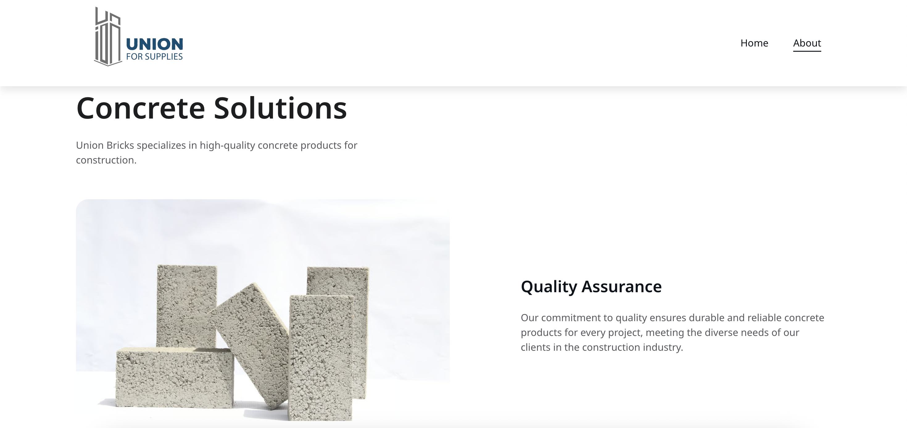

# Union-Bricks-Website

A modern, responsive landing page for a construction materials company. It features a clean design, product showcase, and a contact form. This project demonstrates practical frontend development skills and attention to user experience.

## 🌐 Live Demo

🔗 [Visit the Website](https://union-bricks.com/)

---

## 📸 Screenshots

 
 

---

## 🚀 Features

- ✅ Fully responsive design for all devices
- 🧱 Modern product showcase with clean layout
- 📞 Contact form for user inquiries
- 📍 Embedded map and contact information
- 🧭 Smooth user navigation
- 💼 Professional business design aesthetic

---

## 🛠️ Built With

- HTML5
- CSS3
- JavaScript
- Bootstrap 5 
- Google Fonts 
- Font Awesome 
